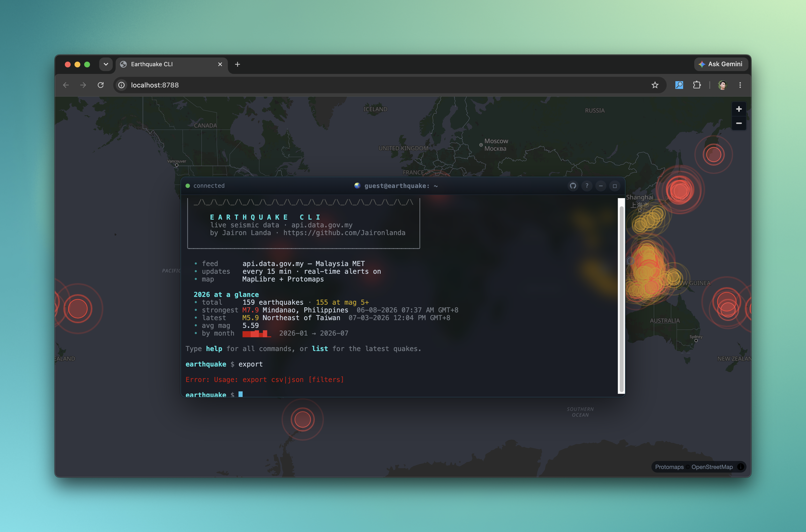

# Earthquake CLI

A web-based terminal for exploring live earthquake data, built on Cloudflare
Workers. Data comes from the Malaysian government open-data feed
([`api.data.gov.my`](https://api.data.gov.my/weather/warning/earthquake/)) — worldwide events relevant to the Malaysia/SE-Asia region, updated continuously and served without authentication.

An xterm.js terminal in the browser where you can `list`, `search`, `filter`,
and `export` earthquakes, see them plotted on a Protomaps map, get real-time
alerts as new events are ingested, and poke around with a handful of "fun &
useful" extras (`stats`, `nearby`, `richter`, `compare`, a year-at-a-glance
`banner`, ...) — all backed by Cloudflare D1, Durable Objects, and Cron
Triggers.



## Quick start (local)

Prerequisites: Node.js 20+, a Cloudflare account (free tier is fine), and
`npx` (ships with npm).

```bash
# 1. Install dependencies
npm install

# 2. Log in to Cloudflare (one-time; opens a browser)
npx wrangler login

# 3. Apply the D1 schema to your local (simulated) database
npx wrangler d1 migrations apply earthquake-db --local

# 4. Provide the admin token used to trigger ingestion (gitignored)
echo 'ADMIN_TOKEN="some-local-secret"' > .dev.vars

# 5. Run the dev server
npm run dev
```

Open **http://localhost:8787** — you'll land on the terminal UI with the map
underneath. The local D1 database starts empty, so pull in some data:

```bash
TOKEN=$(sed -n 's/ADMIN_TOKEN="\(.*\)"/\1/p' .dev.vars)
curl -X POST localhost:8787/admin/ingest -H "Authorization: Bearer $TOKEN"
# → {"fetched":805,"inserted":805,"insertedRows":[...]}   (re-run → "inserted":0)
```

Refresh the page (or type `banner`) and try `help`, `list --mag>5`,
`stats`, `top`, `random`, or `nearby 3.1 101.6` at the prompt.

> First time running Wrangler against this repo? `database_id` in
> [`wrangler.jsonc`](wrangler.jsonc) already points at the provisioned
> `earthquake-db` D1 database, and `--local` runs entirely against a
> simulated SQLite instance in `.wrangler/` — no remote access needed until
> you deploy.

### Optional: map basemap

The map renders on a plain dark canvas out of the box. To get a real vector
basemap, grab a free key from [protomaps.com](https://protomaps.com/dashboard)
and expose it to the browser via `GET /api/config`:

```bash
# local dev — add to .dev.vars
echo 'PROTOMAPS_KEY="<your-key>"' >> .dev.vars
# production — set the var in wrangler.jsonc, or:
npx wrangler secret put PROTOMAPS_KEY
```

The key is a publishable, domain-restrictable basemap token (it ends up in
tile URLs the browser fetches), not a server secret.

## Architecture (current)

```
api.data.gov.my ─fetch─▶ Worker (src/index.ts) ─INSERT OR IGNORE─▶ D1 (earthquakes)
                         POST /admin/ingest + */15 cron            │        │
                              new rows ─broadcast RPC─▶            │        │ query
   xterm.js  ◀─WebSocket──▶ TerminalHub (Durable Object) ◀─────────┘────────┘
   (public/)     /ws     parse command → ANSI reply · push {type:"alert"} to matching tabs
```

After each cron ingest, any genuinely-new rows are pushed to every open terminal
as a `{"type":"alert"}` banner — no page refresh needed (Phase 5). Each
terminal can narrow which alerts it receives with `watch [--mag>N]
[--location STR]`; significant alerts (magnitude ≥ 5) also ring the terminal
bell. The `TerminalHub` uses the WebSocket Hibernation API, so idle tabs cost
nothing yet still receive the fan-out and keep their watch filter/timezone
across hibernation.

`list` / `search` results (and alerts, and the on-connect welcome banner) also
carry a GeoJSON `mapData` payload that a MapLibre GL JS panel plots beside the
terminal as circles sized/coloured by magnitude (Phase 6). The basemap is
Protomaps' hosted dark vector style when a `PROTOMAPS_KEY` is configured;
without one it degrades to a plain dark canvas so points still render.

Every rendered timestamp is shown in the *viewer's* timezone (12-hour
`MM-DD-YYYY hh:mm AM/PM` + short zone label, e.g. `GMT+8`), detected in the
browser and sent to the Durable Object on connect; stored data, `--since`
filters, `trend`/`sparkline` buckets, and CSV/JSON exports all stay UTC.

Each record's primary key is a truncated SHA-256 of `utcdatetime|lat|lon`. The
upstream feed has no id field, so hashing its natural key makes ingestion
idempotent: re-fetching the same feed inserts zero new rows.

- `src/index.ts` — Worker entry; bearer-guarded `POST /admin/ingest`, `GET /api/config` (Protomaps key), `/ws` → Durable Object (rate-limited per IP), else static assets.
- `src/lib/ingest.ts` — fetch, `computeId`, batched upsert; returns the actual newly-inserted rows for alert fan-out.
- `src/durable-objects/terminal-hub.ts` — `TerminalHub` DO: WebSocket Hibernation session hub with per-socket command throttling, `watch` filters, and timezone, all persisted via `serializeAttachment`; `broadcastNewEarthquakes()` RPC fans alerts (with `mapData`, filtered per socket) out to matching sockets.
- `src/lib/commands.ts` — `executeCommand()`: a single command registry drives both dispatch and `help`; parses `help` / `list` / `search` / `export` / `trend` plus the Phase 8 extras (`stats`, `sparkline`, `top`, `nearby`, `minimap`, `compare`, `richter`, `felt`, `random`, `banner`, `watch`/`unwatch`), runs parameterized D1 queries, returns `{text, mapData?, download?, watch?}`.
- `src/lib/format.ts` — ANSI colour + fixed-width table/detail renderers (magnitude colour-coded by severity), viewer-timezone timestamp formatting, `renderAlertBanner()`, `renderTrend()` (ASCII bar chart), and the Phase 8 renderers (`renderStats`, `renderNearbyTable`, `renderRichter`, `renderSparkline`, `renderMinimap`, `renderCompare`).
- `src/lib/export.ts` — `rowsToCSV()` / `rowsToJSON()`: serialize a result set into downloadable file content (Phase 7).
- `src/lib/geojson.ts` — `rowsToGeoJSON()`: converts D1 rows into the map panel's Point FeatureCollection.
- `src/types.ts` — `Env` + API/row types.
- `migrations/0001_init.sql` — `earthquakes` table (structured fields only, no raw JSON).
- `public/index.html` — xterm.js terminal + MapLibre map shell, plus a first-visit help modal; loads xterm, MapLibre GL JS, and the Protomaps basemaps helper via CDN (no build step).
- `public/app.js` — terminal client: opens `/ws` (with the viewer's IANA timezone as `?tz=`), hand-rolls the prompt/line editor (Enter, backspace, cursor keys, ↑/↓ history, Ctrl+A/E/U/L/C), writes ANSI replies to xterm, renders pushed `alert` banners without disturbing the current line, forwards `mapData` to the map, saves `export` downloads via a Blob, and auto-reconnects. Also drives the floating-window UI (minimize/maximize/drag, "ghost" fade when a plot is showing).
- `public/map.js` — MapLibre GL JS map; exposes `window.EarthquakeMap.setFeatures()` / `.addFeatures()`, plots magnitude-scaled circles, and picks a Protomaps or dark-canvas basemap from `/api/config`.
- `public/styles.css` — full-viewport map with the floating terminal window on top (translucent glass, minimize/maximize/ghost states), connection-status indicator, help modal, and dark-themed map chrome.

> **API reference:** the HTTP routes, the `/ws` frame protocol, the full command
> reference, and the data model are documented in [`docs/API.md`](docs/API.md).

### Terminal commands (over `/ws`)

The WebSocket speaks JSON: send `{"type":"input","line":"<command>"}`, receive
`{"type":"output","text":"...ANSI...","mapData":{...GeoJSON}}` (or `welcome` /
`error`). `export` instead returns `{"type":"download","filename","mime","content","text"}`,
which the browser saves to disk. Server-pushed `{"type":"alert","text":"...","mapData":{...},"bell":true}`
frames arrive unsolicited when a cron ingest finds new earthquakes matching
the socket's `watch` filter, if any. `mapData` is a Point FeatureCollection
the browser plots on the map panel. Connect with `?tz=<IANA timezone>` to have
timestamps rendered in your local time (falls back to UTC).

| Command | Purpose |
| ------- | ------- |
| `help` | List available commands. |
| `list [--mag>N] [--since YYYY-MM-DD] [--location STR] [--limit N]` | Recent earthquakes, newest first. |
| `search <id \| text>` | 16-hex id → detail view; otherwise location text search. |
| `export csv\|json [list filters]` | Download the filtered set as a CSV or JSON file. |
| `trend [--by day\|month] [list filters]` | ASCII bar chart of quake counts per time bucket, coloured by peak magnitude. |
| `stats [list filters]` | Summary stats (count, avg/min/max magnitude, depth) for a filtered set. |
| `sparkline [--by day\|month] [list filters]` | Compact Unicode sparkline of quake counts over time. |
| `top [--limit N] [list filters]` | Strongest earthquakes in the filtered set. |
| `nearby <lat> <lon> [--radius KM] [list filters]` | Earthquakes near a coordinate, sorted by distance. |
| `minimap [list filters]` | ASCII lat/lon grid of the filtered set. |
| `compare <A> <B>` | Side-by-side comparison of two earthquakes by id. |
| `richter <mag>` | Severity band + equivalent-TNT-energy readout for a magnitude. |
| `felt <id>` | Human-readable "what would this have felt like" summary for one record. |
| `random` | A random earthquake from the dataset. |
| `banner` | Year-at-a-glance summary (total, mag-5+ count, strongest, latest, avg, monthly sparkline). Also shown on connect. |
| `watch [--mag>N] [--location STR]` | Only receive real-time alerts matching this filter. |
| `unwatch` | Clear the alert filter (receive all alerts again). |

## Development

This section covers things you'd do *after* the [Quick start](#quick-start-local)
is running: poking the backend directly, verifying alerts, and inspecting the
database — useful when you're changing `src/lib/commands.ts`,
`src/durable-objects/terminal-hub.ts`, or the ingest pipeline.

### Talk to the terminal backend without the browser

Any WebSocket client works; here's a one-off with Node's built-in `WebSocket`:

```bash
node --input-type=module -e '
const ws = new WebSocket("ws://localhost:8787/ws");
ws.onmessage = (e) => { console.log(JSON.parse(e.data).text); ws.close(); };
ws.onopen = () => ws.send(JSON.stringify({ type: "input", line: "list --mag>6" }));
'
```

Change `line` to try any [terminal command](#terminal-commands-over-ws), e.g.
`"stats"` or `"nearby 3.1 101.6"`.

### Verify real-time alerts

Alerts only fire when a scheduled ingest finds rows that aren't in D1 yet, so
force that condition locally:

```bash
# 1. Empty the local table so the next ingest treats every row as new
npx wrangler d1 execute earthquake-db --local --command "DELETE FROM earthquakes"

# 2. In one terminal: run dev with cron simulation enabled
npx wrangler dev --test-scheduled

# 3. In another terminal: open a WS client and leave it listening (see above)

# 4. In a third terminal: fire the cron trigger
curl "localhost:8787/__scheduled?cron=*/15+*+*+*+*"
```

The open socket receives an unsolicited `{"type":"alert"}` banner (with `bell`
set if the peak magnitude is ≥ 5). Re-running step 4 without step 1 inserts
nothing and sends no alert, since ingestion is idempotent.

### Inspect the local database

```bash
# Row count
npx wrangler d1 execute earthquake-db --local \
  --command "SELECT count(*) FROM earthquakes"

# Most recent rows
npx wrangler d1 execute earthquake-db --local \
  --command "SELECT id, utcdatetime, magdefault, location FROM earthquakes ORDER BY utcdatetime DESC LIMIT 10"
```

## Testing

Tests run inside the Workers runtime via
[`@cloudflare/vitest-pool-workers`](https://developers.cloudflare.com/workers/testing/vitest-integration/),
with the real `DB` (D1) and `TERMINAL_HUB` (Durable Object) bindings — no
platform mocking. The suite in [`test/`](test) covers HTTP routing, the `/ws`
terminal round-trip, and the command layer (including Phase 8's extras) and
the ingest pipeline.

```bash
npm test          # watch mode
npm run test:run  # single run (CI)
```

The `POST /admin/ingest` success path hits the live upstream feed over the
network, so it's exercised manually (above) rather than in the hermetic suite;
the pipeline itself is unit-tested via `upsertEarthquakes` with fixtures. See
[`docs/API.md`](docs/API.md#testing) for the full breakdown.

## Deployment

```bash
npx wrangler d1 migrations apply earthquake-db --remote
npx wrangler secret put ADMIN_TOKEN
npm run deploy
```

## Commands

| Command | Purpose |
| ------- | ------- |
| `npm run dev` / `npm start` | Run locally via `wrangler dev` |
| `npm run typecheck` | Type-check with `tsc --noEmit` |
| `npm test` / `npm run test:run` | Run the Vitest suite (watch / single run) |
| `npm run deploy` | Deploy via `wrangler deploy` |
| `npx wrangler types` | Regenerate TS types (run after editing bindings in `wrangler.jsonc`) |
| `npx wrangler d1 migrations apply earthquake-db --local\|--remote` | Apply D1 migrations |
